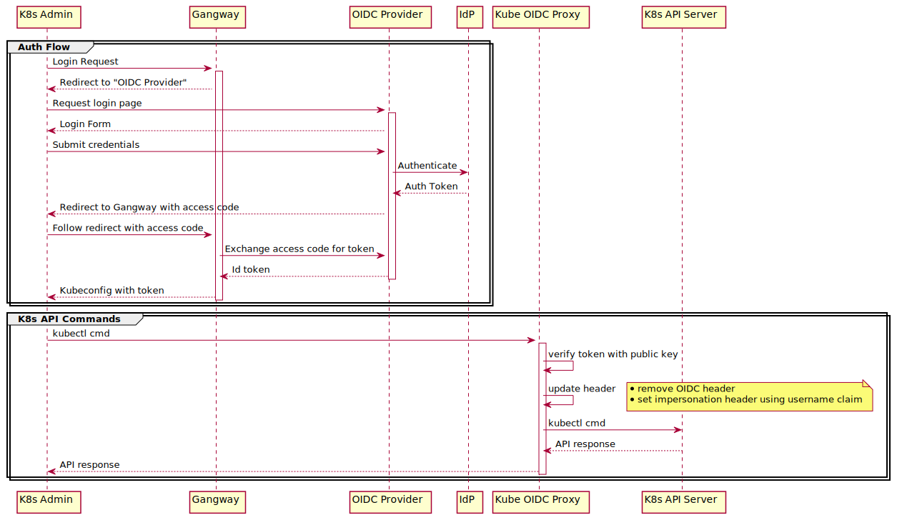

# kube-oidc-proxy from Jetstack running in Azure Kubernetes Service

## Description

kube-oidc-proxy is a reverse proxy used to authenticate users using OIDC to Kubernetes API servers where OIDC authentication is not available (i.e. managed Kubernetes providers such as AKS, GKE, etc).

User authentication is enabled via a request to the OIDC Provider (Dex). This request may be initiated by a tool or site to enable user authentication. Gangway is used for user interactive login. Dex will pass on user information to the Identity Provider (IdP) for authentication and provides an identity token for kubeconfig.

Once the user's kubeconfig is updated then requests may be made using kubectl. The reverse proxy receives kubectl requests, verifies the token in the request using headers inserted by Dex, and validates the tokens using the public key of the configured Identity Provider (e.g., Dex, AAD, Google, etc.). Once the token is verified the OIDC token is removed and impersonation headers are set before passing the request on to the Kubernetes API server and the response is returned to the user. 

Since the proxy server utilises impersonation to forward requests to the API server once authenticated, impersonation is disabled for user requests to the API server.

The following is a diagram of the request flow for a user request:

## Features

- Helm Chart deployment into AKS
- Dex, Gangway, Contour Ingress and Cert-Manager deployment and configurations steps

## Prerequisites

- Azure subscription with permissions to create:
  - Resource Groups, Service Principals, Key Vault, Cosmos DB, Azure Container Registry, Azure Monitor, App Service or AKS
- Bash shell (tested on Mac, Ubuntu, Windows with WSL2)
  - Will not work in Cloud Shell unless you have a remote dockerd
- Azure CLI 2.0.72+ ([download](https://docs.microsoft.com/en-us/cli/azure/install-azure-cli?view=azure-cli-latest))
- Helm v3 ([download](https://helm.sh/docs/intro/install/))
- Visual Studio Code (optional) ([download](https://code.visualstudio.com/download))

## Documentation

- Table of contents is at [docs/index.md](docs/index.md)

## Contributing

This project welcomes contributions and suggestions. Most contributions require you to agree to a
Contributor License Agreement (CLA) declaring that you have the right to, and actually do, grant us
the rights to use your contribution. For details, visit [Microsoft Contributor License Agreement](https://cla.opensource.microsoft.com).

When you submit a pull request, a CLA bot will automatically determine whether you need to provide
a CLA and decorate the PR appropriately (e.g., status check, comment). Simply follow the instructions
provided by the bot. You will only need to do this once across all repos using our CLA.

This project has adopted the [Microsoft Open Source Code of Conduct](https://opensource.microsoft.com/codeofconduct/).
For more information see the [Code of Conduct FAQ](https://opensource.microsoft.com/codeofconduct/faq/) or
contact [opencode@microsoft.com](mailto:opencode@microsoft.com) with any additional questions or comments.
