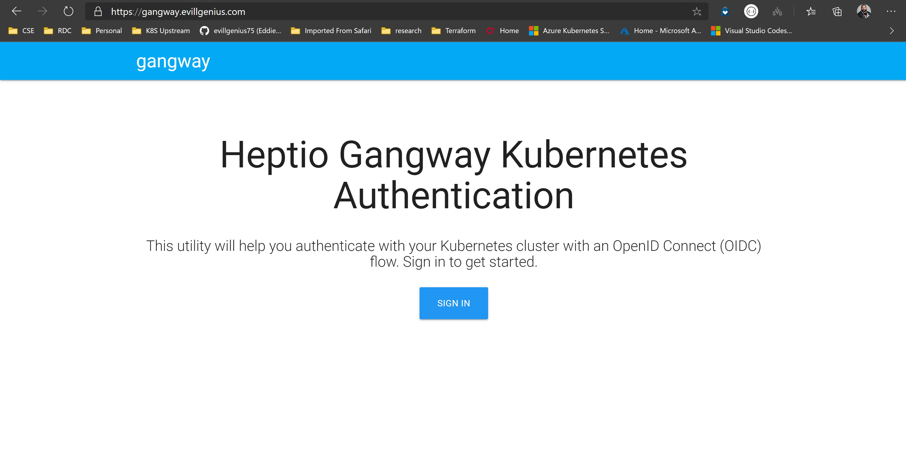

# Gangway Deployment and Configuration

Deploying Gangway consists of writing a config file and then deploying the service. The service is stateless so it is relatively easy to manage on Kubernetes. How you provide access to the service is going to be dependent on your specific configuration.

A good starting point for yaml manifests for deploying to Kubernetes is in the [yaml](../../src/yaml/gangway) directory. This creates a configmap, deployment and service. There is also an example ingress config that is set up to work with Heptio Contour, JetStack cert-manager and Let's Encrypt in the [ingress](../../src/yaml/ingress/gwy-ingress.yaml) directory.

The "client secret" is embedded in this config file.
While this is called a secret, based on the way that OAuth2 works with command line tools, this secret won't be all secret.
This will be divulged to any client that is configured through gangway.
As such, it is probably acceptable to keep that secret in the config file and not worry about managing it as a true secret.

## Setup up the ConfigMap file with needed Values

The key to customizing gangway to integrate with the other components of the system is to properly set up the configMap with the gangway.yaml contents and the ca-cert for the certificate the kube-proxy-oidc ingress is assigned to. In this example walkthrough the kube-oidc-proxy is getting its certificate from Let's Encrypt through cer-manager, so this requires that we add the Intermmediate Signing CA for Let's Encryt which can be found [here](https://letsencrypt.org/certificates/#intermediate-certificates). The sample file looks like this:

```yaml
apiVersion: v1
data:
  cluster-ca.crt: |
    -----BEGIN CERTIFICATE-----
    MIIEkjCCA3qgAwIB.........
    ##########################################################################################################
    ## Issuer Certificate for the TLS authority for kube-proxy-oidc service
    ## In this example it would be the Let's Encrypt Issuer CA Cert
    ## The updated Cert signiture can be found at https://letsencrypt.org/certificates/#intermediate-certificates
    ## If you aply a custom Certificate to Kube-oidc-proxy ingress serice than the Root or Intermediate CA needs to be
    ## configured here
    ##########################################################################################################
    DNFu0Qg==
    -----END CERTIFICATE-----
  gangway.yaml: |-
    {
      "apiServerURL": "https://kube-oidc-proxy.INSERT_OWN_DOMAIN.HERE",
      "authorizeURL": "https://dex.INSERT_OWN_DOMAIN.HERE/auth",
      "authorize_url": "https://gangway.INSERT_OWN_DOMAIN.HERE/auth",
      "certFile": "/etc/gangway/tls/tls.crt",
      "clientID": "75UiO2E81m5Vi3nST4269fuO", #random string used in the config of dex staticClient
      "clientSecret": "kubYhdk7TBZCO4H1MwF0RpuT", #random string used in the config of dex staticClient
      "clusterName": "oidcproxy.INSERT_OWN_DOMAIN.HERE",
      "keyFile": "/etc/gangway/tls/tls.key",
      "redirectURL": "https://gangway.INSERT_OWN_DOMAIN.HERE/callback",
      "scopes": [
        "openid",
        "email",
        "profile",
        "groups",
        "offline_access"
      ],
      "serveTLS": true,
      "tokenURL": "https://dex.INSERT_OWN_DOMAIN.HERE/token",
      "usernameClaim": "name"
    }
kind: ConfigMap
metadata:
  labels:
    name: gangway
  name: gangway
  namespace: auth
```

If running through the sample documentation here to configure an environment, the only changes needed are replacing `INSERT_OWN_DOMAIN.HERE` with a valid DNS name that is being used or the example walkthrough (See the [ingress readme](../ingress/README.md)).

The `clientID` and `clientSecret` values can also be changed as long as they match the same fields in the [dex configuration file](../../src/yaml/dex/dex-config.yaml).

once the file has been eddited apply it to the auth namespace

```bash
kubectl -n auth apply -f src/yaml/gangway/gwy-config.yaml
```

We also have a secret string that is used to as a way to encrypt the cookies that are returned to the users.
If using the example YAML, create a secret to hold this value with the following command line:

```bash
kubectl -n auth create secret generic gangway \
  --from-literal=sessionkey=$(openssl rand -base64 32)
```

## Deploy the rest of gangway

Now that the configMap is saved to the cluster apply the cert request and then the rest of the yaml files to deploy the gangway service. Edit the gwy-cert.yaml file to update the domain name then

```bash
kubectl -n auth apply -f src/yaml/gangway/gwy-cert.yaml
```

Verify that the cert has been aquired by describing the gnagway cert

```bash
kubectl -n auth describe certificate gangway
```

A successful Certiicate assignment will show the last few lines as such

```bash
Name:         dex
Namespace:    auth
Labels:       name=dex
Annotations:  API Version:  cert-manager.io/v1alpha3
Kind:         Certificate
...
Events:
  Type    Reason  Age   From          Message
  ----    ------  ----  ----          -------
  Normal  Issued  38s   cert-manager  Certificate issued successfully
```

Now deploy the other yaml files in the sample directory

```bash
kubectl -n auth apply -f src/yaml/gangway/gwy-deploy.yaml
kubectl -n auth apply -f src/yaml/gangway/gwy-service.yaml
```

Verify that the gangway pod is online

```bash
kubectl -n auth get pods
```

Once the gangway pod is in a ready state try to open the gangway landing page by opening your browser and navigating to https://gangway.YOUR_OWN_DOMAIN.HERE.

This should bring you to the gangway login page



If this is successful the deployment should be complete. Now to test the process read the [User Scenario](../user/README.md) readme.