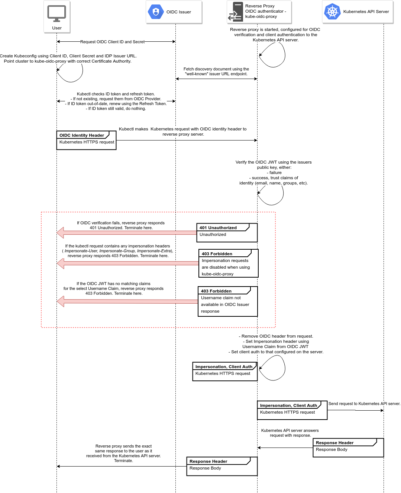

# kube-oidc-proxy Deployment and Configuration

kube-oidc-proxy is a reverse proxy server to authenticate users using OIDC to Kubernetes API servers where OIDC authentication is not available (i.e. managed Kubernetes providers such as AKS, GKE, etc).

This intermediary server takes kubectl requests, authenticates the request using the configured OIDC Kubernetes authenticator, then attaches impersonation headers based on the OIDC response from the configured provider. This impersonated request is then sent to the API server on behalf of the user and it's response passed back. The server has flag parity with secure serving and OIDC authentication that are available with the Kubernetes API server as well as client flags provided by kubectl. In-cluster client authentication is also available when running kube-oidc-proxy as a pod.

Since the proxy server utilises impersonation to forward requests to the API server once authenticated, impersonation is disabled for user requests to the API server.

The following is a diagram of the request flow for a user request.



## Configure the Yaml deployment files

For the example run through the kube-oidc-proxy pod will run in cluster and needs to be configured to talk with the dex environment set up in the previous step.

The two files that need to be customized for this example deployment are [kop-cert.yaml](../../src/yaml/kube-oidc-proxy/kop-cert.yaml) and [kop-secretconfig.yaml](../../src/yaml/kube-oidc-proxy/kop-secretconfig.yaml).

kop-cert.yaml only needs to have the custom domain used for the example run through you are runnning. Replace the INSERT_OWN_DOMAIN.HERE with your own. As an example

```yaml
apiVersion: cert-manager.io/v1alpha2
kind: Certificate
...
spec:
  dnsNames:
  - kube-oidc-proxy.evillgenius.com # Use your own domain here
  issuerRef:
    kind: ClusterIssuer
    name: letsencrypt-prod
  secretName: kube-oidc-proxy-tls
```

The kop-secretconfig.yaml file has 2 fields that must be configured. In the data of the secret there are 2 secerets.

```yaml
apiVersion: v1
data:
  oidc.client-id: NzVVaU8yRTgxbTVWaTNuU1Q0MjY5ZnVP # Base64 encoded version of DEX staticClient config ClientID
  oidc.issuer-url: aHR0cHM6Ly9kZXguSU5TRVJUX09XTl9ET01JQU4uSEVSRQ== # Base64 Encoded value of dex URL i.e. https://dex.INSERT_OWN_DOMAIN.HERE
kind: Secret
...
type: Opaque
```

`oidc.client-id` is the shared client ID of the dex oauth2client that was created in the staticClient configuration of the dex deployment. This value can be any random string, but requires it to be the same throughout the example deployment. The string value then must be base64 encoded. Replace the value with the value used in your walkthrough.

`oidc.issuer-url` is the secure url of the dex server. In this example we configured dex to have its own domain and ingress with `https://dex.INSERT_OWN_DOMAIN.HERE` where the custom domain used through the example deployment replaces the placeholder `INSERT_OWN_DOMAIN.HERE`. Again the value must be base64 encoded and copied into the yaml file.

## Deploy the kube-oidc-proxy pod

Apply the yaml files in `src/yaml/kube-oidc-proxy` directory in the following order

```bash
kubectl -n auth apply -f src/yaml/kube-oidc-proxy/kop-cert.yaml
kubectl -n auth apply -f src/yaml/kube-oidc-proxy/kop-secretconfig.yaml
kubectl -n auth apply -f src/yaml/kube-oidc-proxy/kop-serviceaccount.yaml
kubectl -n auth apply -f src/yaml/kube-oidc-proxy/kop-clusterrole.yaml
kubectl -n auth apply -f src/yaml/kube-oidc-proxy/kop-clusterrolebinding.yaml
kubectl -n auth apply -f src/yaml/kube-oidc-proxy/kop-deploy.yaml
kubectl -n auth apply -f src/yaml/kube-oidc-proxy/kop-service.yaml
```

## Verify the deployment is running

Verify the pod is running successfully by issues a `kubectl -n auth get pods` command and you should see the dex pod and the kube-oidc-proxy pods in a ready state.

### Optional

If in your walkthrough example you decided to use a self-signed certificate for the TLS secerets for the different services instead of using Let's Encrypt through Cert-manager then at this time you need to make sure that you have the CA Cert signiture ready for the Gangway configuration.

## Next steps

Now the gangway service can be deployed. Follow the steps in the [Gangway Configuration and Deployment README](../gangway/README.md).
